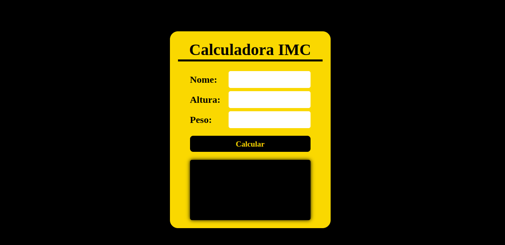
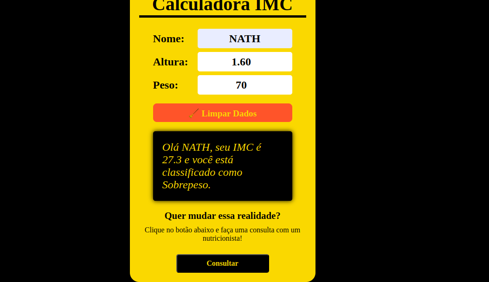

# 🧮 Calculadora de IMC

Uma calculadora de IMC simples, responsiva e funcional, feita com **HTML**, **CSS** e **JavaScript**, que também envia os dados para um backend e permite contato via **WhatsApp** com um nutricionista. 🥗

---

## 📸 Preview



---

## 🚀 Funcionalidades

- ✅ Cálculo do IMC em tempo real
- ✅ Classificação automática (Abaixo do peso, Normal, Sobrepeso, Obesidade)
- ✅ Botão que muda entre **Calcular** e **Limpar**
- ✅ Interface clara e responsiva
- ✅ Envio dos dados para um backend (opcional)
- ✅ Botão de consulta via WhatsApp



---

## 🛠️ Tecnologias Utilizadas

- HTML5
- CSS3
- JavaScript (Vanilla)

---

## 💡 Como Usar

1. Clone este repositório:

   ```bash
   git clone https://github.com/seu-usuario/seu-repositorio.git
   ```
